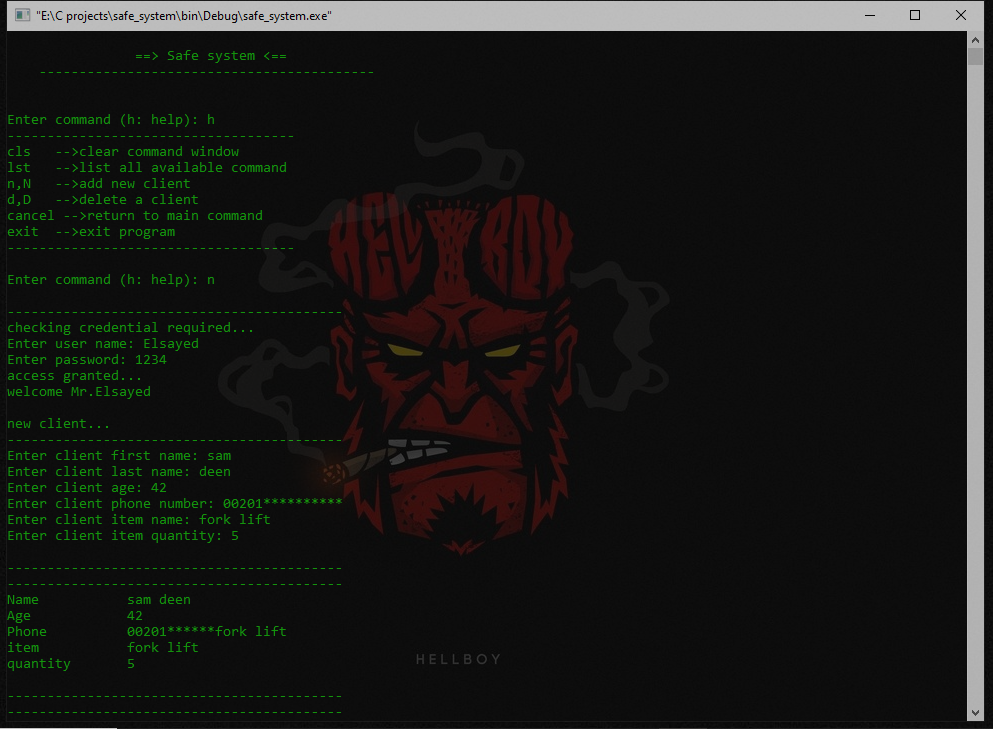

<div align="center">

  
  <h1>Secure-Warehouse-System</h1>
  
  <p>
    An account (username & password) protect clients' data for the warehouse system, with different commands. 
  </p>
  
<!-- System authentication -->
### System Authentication
`username: Elsayed`<br />
`password: 1234`
  
</div>

<br />

<!-- Table of Contents -->
# Table of Contents

- [About the Project](#about-the-project)
  * [System API](#system-api)
  * [Features](#features)
-  [Functions](#functions)
- [Contributing](#contributing)
- [License](#license)
- [Contact](#contact)
- [Acknowledgements](#acknowledgements)
  

<!-- About the Project -->
## About the Project

<div align="center"> 
  
</div>


<!-- System API -->
### System API

- `client_add`
- `client_delet`
- `list_d`
- `clear_c`
- `logout`

<!-- Features -->
### Features

- account (username & password) protected.
- store data into encrypted files.
- multiple command option.

<!-- Functions -->
## Functions

Use this space to tell a little more about your project and how it can be used. Show additional screenshots, code samples, demos or link to other resources.


```c
/*****************************************************************************
 * check_user: checking credential, username & password.                     *
 *             return user_check;                                            *
 *****************************************************************************/
 int check_user (void)
 {
     if (user_check == 0)
     {
         printf("\n------------------------------------------\n");
         printf("checking credential required...\n");
         A:
         printf("Enter user name: ");
         scanf(" %[^\n]%*c", entered_user);
         CHECK_U(entered_user)
         printf("Enter password: ");
         scanf(" %[^\n]%*c", entered_pass);
         CHECK_U(entered_pass)
         for(int i = 0; entered_user[i] != '\0'; i++)
            {
                if (entered_user[i] != user_1[i])
                {
                    printf("incorrect user name or password!\n\n");
                    goto A;
                }
            }
         for(int i = 0; entered_pass[i] != '\0'; i++)
            {
                if (entered_pass[i] != pass_1[i])
                {
                    printf("incorrect user name or password!\n\n");
                    goto A;
                }
            }
            printf("access granted...\n");
     printf("welcome Mr.%s\n", user_1);
     user_check = 1;
     }
     else
        user_check = 1;
     return user_check;
 }
```

```c
/*****************************************************************************
 * assess: return list: 0-> wrong command.                                   *
 *                      1-> clear(cls).                                      *
 *                      n-> new client(n|N).                                 *
 *                      x-> exit(exit|EXIT).                                 *
 *                      l-> list(lst).                                       *
 *                      h-> help(h|H).                                       *
 *****************************************************************************/
int assess (char *c)
{
    int i=0;
    char *p = c;
    while (*p++ != '\0'){
        i++;
        if (*p == ' ')
        {
            printf("\'%s\' is not recognized as an internal or external command!\n\n", p-i);
            return 0;
        }
    }
    switch (c[0]){

        // 1. cls: clear.
        case 'c':
            for(int i=1; i<=3; i++)
            {
                if ("cls\0"[i] != c[i])
                {
                    printf("\'%s\' is not recognized as an internal or external command!\n\n", c);
                    return 0;
                }
            }
            return 1;

        // 2. n&N: new client.
        case 'n': case 'N':
            return 'n';

        // 3. exit: exit program.
        case 'e': case 'E':
            for(int i=1; i<=4; i++)
            {
                if ("exit\0"[i] != c[i])
                {
                    printf("\'%s\' is not recognized as an internal or external command!\n\n", c);
                    return 0;
                }
            }
            return 'x';

        // 4. lst: list all client.
        case 'l': case 'L':
            for(int i=1; i<=3; i++)
            {
                if ("lst\0"[i] != c[i])
                {
                    printf("\'%s\' is not recognized as an internal or external command!\n\n", c);
                    return 'l';
                }
            }
            return 'l';

        // 5. d&D: delete client.
        case 'd': case 'D':
            return 'd';

        // 6. h|H: help.
        case 'h': case 'H':
            return 'h';
        // 7. out: logout user.
        case 'o':
            for(int i=1; i<=3; i++)
            {
                if ("user\0"[i] != c[i])
                {
                    printf("\'%s\' is not recognized as an internal or external command!\n\n", c);
                    return 'l';
                }
            }
            return 'o';
        // wrong command.
        default:
            printf("\'%s\' is not recognized as an internal or external command!\n\n", c);
            return 0;
        }
    return 0xff;
}
```
```c
#ifndef FUN_H
#define FUN_H

#define CHECK_U(elemint) for(int i=0; i<=7; i++) \
            {                                    \
                if ("cancel\0"[i] != elemint[i]) \
                    break;                       \
                else if (i == 7)                 \
                return user_check;                         \
            }

/*****************************************************************************
 * scan_f:                                                                   *
 *                                                                           *
 *****************************************************************************/
int scan_f (char *c);

/*****************************************************************************
 * assess: return list: 0-> wrong command.                                   *
 *                      1-> clear(cls).                                      *
 *                      n-> new client(n|N).                                 *
 *                      x-> exit(exit|EXIT).                                 *
 *                      l-> list(lst).                                       *
 *                      h-> help(h|H).                                       *
 *****************************************************************************/
int assess (char *c);

/*****************************************************************************
 * check_user:                                                               *
 *                                                                           *
 *****************************************************************************/
 int check_user (void);

#endif // FUN_H
```
<!-- Contributing -->
## Contributing

Contributions are always welcome!


<!-- License -->
## License

Distributed under the no License. See LICENSE.txt for more information.


<!-- Contact -->
## Contact

Elsayed Atif Aner - [facebook](https://www.facebook.com/alsayed.atif) - alsayedatif88@gmail.com

Project Link: [https://github.com/Elsayed-Aner/Secure-Warehouse-System](https://github.com/Elsayed-Aner/Secure-Warehouse-System)

<!-- Acknowledgments -->
## Acknowledgements

Use this section to mention useful resources and libraries that you have used in your projects.

 - [Alex Fosdick](https://www.coursera.org/instructor/~19507668)
 - [Quantum Leaps, LLC](https://www.youtube.com/@StateMachineCOM)
